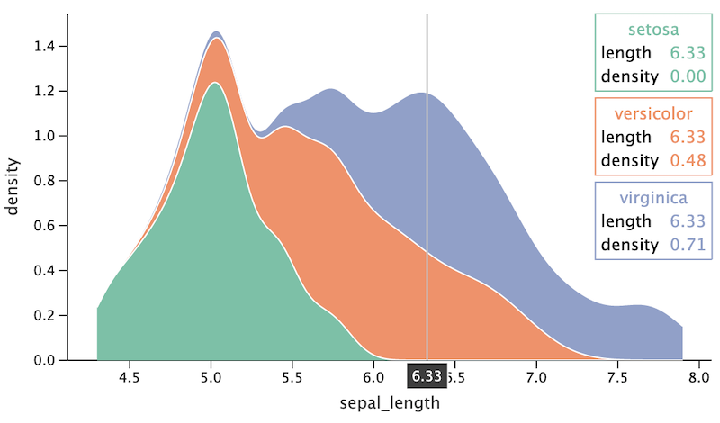

# Tooltip Customization

- [Tooltip `variables` parameter](#variables)
  - [Examples](#example-variables)
- [Formatting tooltip fields](#formatting)
- [Customizing tooltip lines](#lines)
  - [Labels configuration](#labels-configuration)
- [Tooltip anchor](#tooltip-anchor)
- [Minimum width of a general tooltip](#minwidth)
- [Tooltip color](#color)
- [Examples](#examples)
- [Outlier tooltips configuration](#outliers)
  - [Examples](#example-outliers)
- [Hiding tooltips](#hiding-tooltips)
- [Example Notebooks](#example-notebooks)

------
You can customize the content of tooltips for the layer by using the parameter `tooltips` of `geom` functions.

The following functions set lines, define formatting of the tooltip, its location and width:

```
tooltips=layerTooltips(variables)
    .format(field, format)
    .line(template)
    .anchor(position)
    .minWidth(value)
```

<a id="variables"></a>

### Tooltip `variables` parameter (optional): `layer_tooltips("varName1", ... , "varNameN" )`

The `variables` parameter defines a list of variable names, which values will be placed line by line in the general
tooltip. If formatting is specified for a variable from this list (with the `format` function), it will be applied.
Otherwise, the default formatting is used. Additional tooltip lines can be specified using the `line` functions.

This is useful for configuring the tooltip content, instead of using the `line()` method to configure each line of the
tooltip.

<a id="example-variables"></a>

### Examples

Set list of variables to place them in a multiline tooltip with the default formatting:

```
letsPlot(mpg) + geomPoint(shape=21, color='black',
                         tooltips=layerTooltips("manufacturer", "model", "class", "drv")) {
                           x="displ"
                           y="cty"
                           fill="drv"
                           size="hwy" 
                         }
```


<a id="formatting"></a>

### Formatting tooltip fields: `layerTooltips().format(field, format)`

Defines the format for displaying the value. The format will be applied to the mapped value in the default tooltip or to
the corresponding value specified in the `line` template.

#### Arguments

- `field` (string): The name of the variable/aesthetics. The field name begins with `^` for aesthetics. You can specify
  variable names without a prefix, but the `@` prefix can be also used. It's possible to set a format for all positional
  aesthetics: `^X` (all positional x) and `^Y` (all positional y). For example:
  - `field = "^Y"` - for all positional y;
  - `field = "^y"` - for y aesthetic;
  - `field = "y"` - for variable with the name "y".

- `format` (string): The format to apply to the field. The format contains a number format (`'1.f'`) or a string
  template (`'{.1f}'`). The numeric format for non-numeric value will be ignored. The string template contains
  “replacement fields” surrounded by curly braces `{}`. Any code that is not in the braces is considered literal text,
  and it will be copied unchanged to the result string. If you need to include a brace character into the literal text,
  it can be escaped by doubling: {{ and }}. For example:
  - `.format("^color", ".1f")` -> `"17.0"`;
  - `.format("cty", "{.2f} (mpg)"))` -> `"17.00 (mpg)"`;
  - `.format("^color", "{{{.2f}}}")` -> `"{17.00}"`;
  - `.format("model", "{} {{text}}")` -> `"mustang {text}"`.

The string template in the `format` parameter will allow changing lines for the default tooltip without `line`
specifying.

Variable's and aesthetic's formats are not interchangeable, for example, `var` format will not be applied to `aes`
mapped to this variable.

<a id="lines"></a>

### Customizing tooltip lines: `layerTooltips().line(template)`

Specifies the string template to use in a general tooltip. If you add `line()`, it overrides the default tooltip.

Variables and aesthetics can be accessed via a special syntax:

- `^color` for aesthetic;
- `@year` for variable;
- `@{number of cylinders}` for a variable with spaces or non-word characters in the name;
- `@..count..` for statistics variables.

A '^' symbol can be escaped with a backslash; a brace character in the literal text - by doubling:

- `.line("text")` -> `"text"`;
- `.line("\^text")` -> `"^text"`;
- `.line("{{text}}")` -> `"{text}"`;
- `.line("@model")` -> `"mustang"`;
- `.line("{{@model}}")` -> `"{mustang}"`.

<a id="labels-configuration"></a>

#### Labels configuration

The default tooltip has a label before the value usually containing the name of the mapped variable. It has its own
behaviour similar to a blank label for an axis aesthetics. This default label can be set in the template by using a pair
of symbols `@|`. You can override the label by specifying a string value before `|` symbol.

Within the tooltip line, ou can align a label to left. The string formed by a template can be aligned to right. If you
do not specify a label, the string will be centered in the tooltip. For example:

- `line("^color")`: no label, value is centered;
- `line("|^color")`: label is empty, value is right-aligned;
- `line("@|^color")`: default label is used, value is right-aligned;
- `line("my label|^color")`: label is specified, value is right-aligned.

<a id="tooltip-anchor"></a>

### Tooltip anchor: `layerTooltips().anchor(position)`

Specifies a fixed position for a general tooltip.

The `anchor()` function accepts the following values:

- 'top_right'
- 'top_center'
- 'top_left'
- 'bottom_right'
- 'bottom_center'
- 'bottom_left'
- 'middle_right'
- 'middle_center'
- 'middle_left'

<a id="minwidth"></a>

### Minimum width of a general tooltip: `layerTooltips().minWidth(value)`

Specifies a minimum width of a general tooltip in pixels.

<a id="Color"></a>

### Tooltip color: `layerTooltips().color(value)`

Specifies a color of a general tooltip.

<a id="examples"></a>

### Examples

```
letsPlot(mpg) { x = "displ"; y = "cty" } + theme().legendPositionNone() +
    geomPoint(shape = 21, 
               color = "black",
               tooltips = layerTooltips()
                          .format("cty", ".1f")
                          .format("hwy", ".1f")
                          .format("drv", "{}wd")
                          .line("@manufacturer @model")
                          .line("cty/hwy|@cty/@hwy")
                          .line("@|@class")
                          .line("drive train|@drv")
                          .line("@|@year")) {fill = "drv"; size = "hwy"}
```


Change format for the default tooltip:

```
letsPlot(mpg) { x = "displ"; y = "cty" } + 
    geomPoint(shape = 21,
               color = "black",
               tooltips = layerTooltips().format("^size", "{.2f} (mpg)")) { fill="drv"; size="hwy" }
```


Place a general tooltip at the top center and define its minimum width:

```
letsPlot(mpg) +
    geomPoint(
        shape=21, color="black",
        tooltips=layerTooltips()
                   .format("cty", ".1f")
                   .format("hwy", ".1f")
                   .format("drv", "{}wd")
                   .line("@manufacturer @model")
                   .line("cty/hwy|@cty/@hwy")
                   .line("@|@class")
                   .line("drive train|@drv")
                   .line("@|@year")
                   .anchor("top_center")
                   .minWidth(200) 
    ) { x = "displ"; y = "cty"; fill="drv"; size="hwy" }
```


Move the tooltips to the top right corner:

```
letsPlot(iris) + theme().legendPositionNone() +
    geomArea(
        stat=Stat.density(),
        tooltips=layerTooltips()
                   .anchor("top_right")
                   .line("^fill")
                   .line("length|^x")
                   .line("density|^y")
    ) { x="sepal_length"; color="sepal_width"; fill="species" }
```                 



<a id="outliers"></a>

## Outlier tooltips configuration

The default an outlier's tooltip contains a string like `'name: value'`: there is no label and no alignment. It's
possible to change formatting of it with the `format` function. The number format (`'1.f'` ) leaves the string as
is (`'name: value'`) and formats the value. The string template replaces the default string:
`‘{.1f}` - with `'value'`, `‘format text {.1f}’` - with `“format text value”`.

The specified `line` for an outlier will move it to a general multi-line tooltip.

<a id="example-outliers"></a>

### Examples

`val p = letsPlot(mpg) { x = "class"; y = "hwy" } + theme().legendPositionNone()`

Change formatting for outliers:

```
p + geomBoxplot(tooltips = layerTooltips()
                    .format("^Y", ".2f")                 // all positionals
                    .format("^ymax", ".3f")              // use number format --> "ymax: value"
                    .format("^middle", "{.3f}")          // use line format --> "value"
                    .format("^ymin", "ymin is {.3f}"))
```                        


Move outliers to a general tooltip:

```
p + geomBoxplot(tooltips=layerTooltips()
                   .format("^Y", ".1f")
                   .line("y min/max|^ymin/^ymax")
                   .line("lower/upper|^lower/^upper")
                   .line("@|^middle"))
```


Place tooltip at the top center and change its color:

``` 
p + geomBoxplot(tooltips=layerTooltips()
                   .anchor("top_center")
                   .color("cyan")
                   .format("^Y", ".0f")
                   .format("^middle", ".2f")
                   .line("@|^middle")
                   .line("lower/upper|^lower/^upper")
                   .line("min/max|^ymin/^ymax"))
``` 


<a id="hiding-tooltips"></a>

## Hiding tooltips

Set `tooltips = tooltipsNone` to hide tooltips from the layer.

<a id="example-notebooks"></a>

## Example Notebooks

* [tooltip_config.ipynb](https://nbviewer.jupyter.org/github/JetBrains/lets-plot-kotlin/blob/master/docs/examples/jupyter-notebooks/tooltip_config.ipynb)
* Visualization of Airport Data on
  Map: <a href="https://www.kaggle.com/alshan/visualization-of-airport-data-on-map" title="View at Kaggle">
  
  </a>
  <br>
